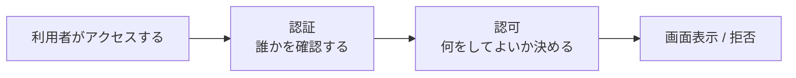
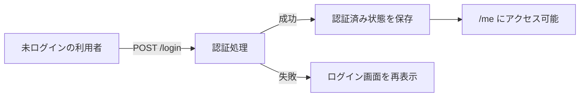
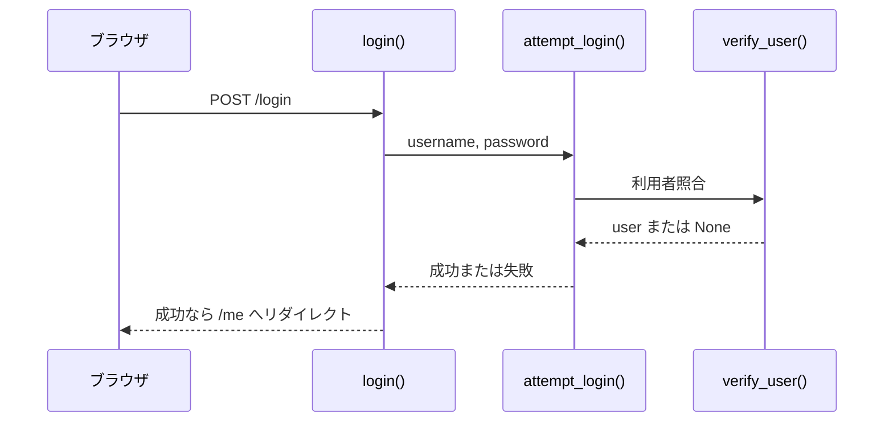
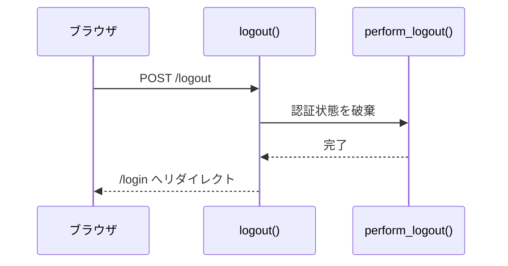
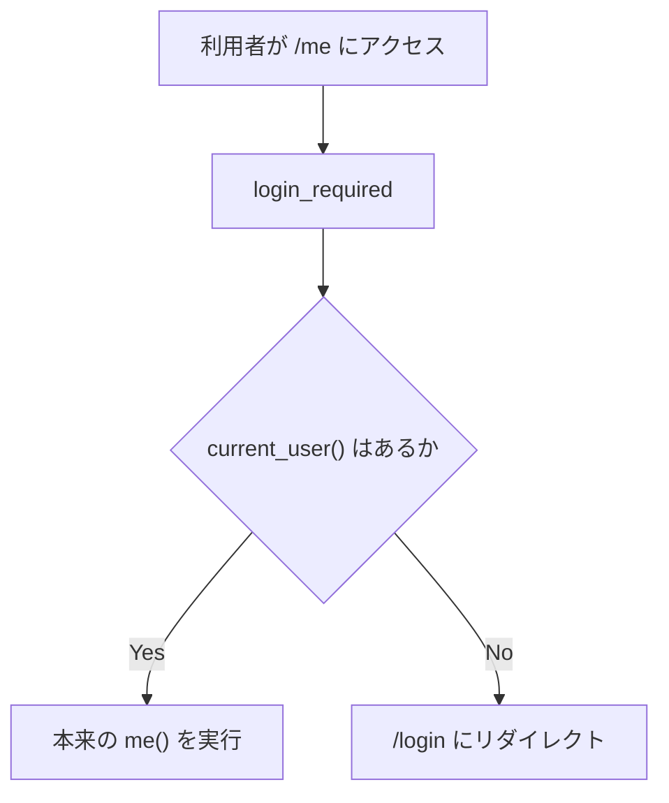
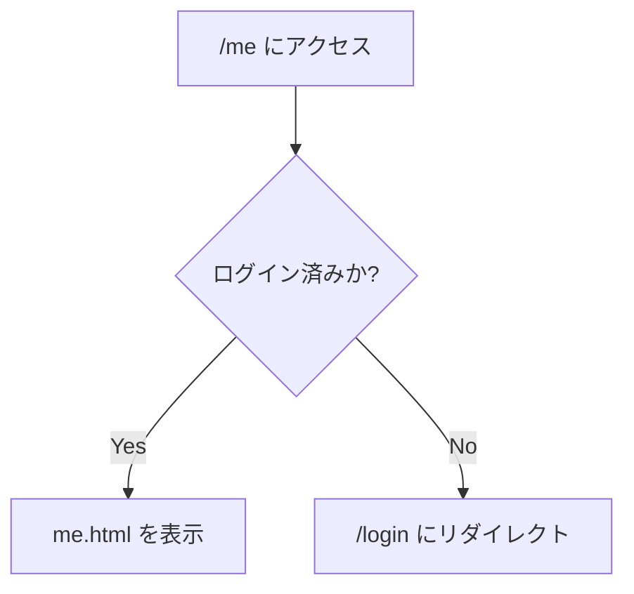
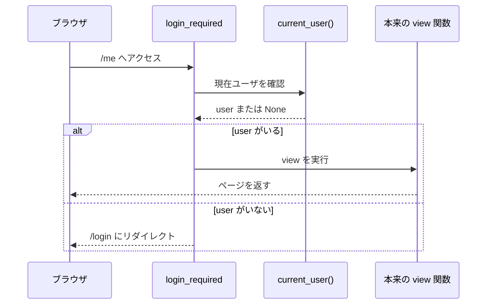

# 第2回
## ログイン・ログアウトと認証の基礎

- 科目: Web アプリケーション脆弱性演習
- テーマ: 認証の基本的な流れを理解する
- 目標: ログイン、ログアウト、保護ページの仕組みをコードから説明できる

---

# 今日の到達目標

- 認証と認可の違いを説明できる
- ログイン処理の流れを説明できる
- ログアウト処理の流れを説明できる
- 保護ページがどのように制御されるか説明できる
- `login_required` の役割を説明できる

---

# 今日扱う内容

1. 認証と認可
2. ログインの流れ
3. ログアウトの流れ
4. 保護ページの考え方
5. Flask 側の実装
6. 演習

---

# 前回の復習

- Flask アプリは URL ごとに処理を分ける
- `routes.py` にルーティングが書かれている
- `templates/` に画面がある
- フォームは `POST` で送信される

今日の焦点:

- ログインした状態とは何か
- ログインしていないときに何が起きるか

---

# 認証と認可

- 認証:
  - あなたが誰かを確認する
  - 例: `alice / alicepass` でログインする
- 認可:
  - 何をしてよいかを決める
  - 例: `admin` だけが `/admin` を見られる

まずは認証を理解することが重要。

---

# 認証と認可の関係



例:

- 認証:
  - `alice` でログインできるか
- 認可:
  - `alice` が `/admin` に入れるか

---

# 今日使う主な画面

- `/login`
  - ログイン画面
- `/logout`
  - ログアウト処理
- `/me`
  - 認証済みユーザ向けページ
- `/admin`
  - 認可の例として後半で少し触れる

---

# 認証のイメージ



---

# ログイン処理の全体像

1. `/login` を開く
2. ユーザ名とパスワードを入力する
3. `POST /login` が送られる
4. サーバが認証する
5. 成功なら認証状態を保存する
6. `/me` に移動する

---

# ログイン成功のシーケンス図



---

# ログイン失敗時はどうなるか

- 入力不足ならエラー
- ユーザ名またはパスワードが違えばエラー
- ログイン画面を再表示する

重要:

- サーバ側で判定している
- ブラウザ側だけで成功・失敗を決めていない

---

# ログアウトの考え方

- 認証済み状態を破棄する
- その後は保護ページに入れなくなる
- もう一度使うには再ログインが必要

---

# ログアウトのシーケンス図



---

# 保護ページとは

保護ページ:

- ログインしていないと見られないページ

このアプリでは:

- `/me`
- `/profile`
- `/users`
- `/board`
- `/ping`

---

# 保護ページの制御イメージ



---

# 未ログインで `/me` に行くとどうなるか



---

# コード解説 1
## `app/services/auth_service.py`

```python
def attempt_login(username, password):
    if not username or not password:
        return None, "Username and password are required.", None

    user = verify_user(username, password)
    if user is None:
        return None, "Invalid username or password.", None

    cookie_value = login_user(user)
    return user, None, cookie_value
```

ポイント:

- 入力が空なら失敗
- `verify_user()` で利用者確認
- 成功時に `login_user(user)` を呼ぶ

---

# コード解説 2
## `app/routes.py` の `/login`

```python
@main_bp.route("/login", methods=["GET", "POST"])
def login():
    if request.method == "POST":
        user, error, cookie_value = attempt_login(
            request.form.get("username", "").strip(),
            request.form.get("password", ""),
        )
        ...
    return render_template("login.html")
```

ポイント:

- `GET` は画面表示
- `POST` は認証処理
- 同じ URL でも役割が分かれている

---

# コード解説 3
## `verify_user()`

```python
def verify_user(username, password):
    user = get_user_by_username(username)
    if user is None or user.password != password:
        return None
    return user
```

ポイント:

- DB からユーザを探す
- パスワードが一致するか確認する
- 一致しなければ `None`

注意:

- これは教材用の簡略化された実装

---

# コード解説 4
## `app/routes.py` の `/logout`

```python
@main_bp.post("/logout")
@csrf_protect
def logout():
    cookie_name = perform_logout()
    flash("You have been logged out.", "success")
    response = redirect(url_for("main.login"))
    ...
    return response
```

ポイント:

- `POST /logout` で処理する
- `perform_logout()` で認証状態を削除する
- 最後に `/login` へ戻す

---

# コード解説 5
## `login_required`

```python
def login_required(view_func):
    @wraps(view_func)
    def wrapped(*args, **kwargs):
        user = current_user()
        if user is None:
            flash("Please log in first.", "error")
            return redirect(url_for("main.login"))
        return view_func(*args, **kwargs)
```

ポイント:

- 現在ユーザがいるか確認する
- いなければ `/login` へ送る
- いれば元の処理を続ける

---

# `login_required` の動作図



---

# デコレータの意味

```python
@main_bp.get("/me")
@login_required
def me():
    return render_template("me.html")
```

意味:

- `/me` はログインしている人だけ見られる
- 未ログインなら `me()` の中身まで進まない

---

# 認証済み状態とは何か

今日の段階では次の理解でよい。

- サーバは「この利用者はログイン済み」と判断できる状態を持つ
- その状態を使って保護ページの可否を決める

次回以降:

- Cookie 型認証
- サーバセッション型認証

を詳しく比較する

---

# ハンズオン 1
## ログインとログアウトを試す

1. `/login` を開く
2. 正しい情報でログインする
3. `/me` を確認する
4. ログアウトする
5. 再度 `/me` を開く

確認すること:

- ログイン後にどこへ移動するか
- ログアウト後にどう変わるか

---

# ハンズオン 2
## ログイン失敗を試す

次を試す。

1. ユーザ名を空にする
2. パスワードを空にする
3. 間違ったパスワードを入れる

確認すること:

- どんなメッセージが出るか
- 成功時と画面遷移がどう違うか

---

# ハンズオン 3
## 保護ページを確認する

未ログイン状態で次を開く。

- `/me`
- `/profile`
- `/board`

その後でログインして同じページを開く。

考えること:

- なぜ結果が変わるのか
- どのコードがその差を作っているのか

---

# 演習 1
## `/login` の役割を整理する

`app/routes.py` を見て、`/login` について次を答える。

1. `GET` のとき何をしているか
2. `POST` のとき何をしているか
3. 成功時にどこへ移動するか
4. 失敗時にどうなるか

---

# 演習 2
## `attempt_login()` を読む

`app/services/auth_service.py` を見て、次を説明する。

1. 入力不足のときどうなるか
2. 認証失敗のときどうなるか
3. 認証成功のとき何が返るか

---

# 演習 3
## `login_required` を読む

`app/auth/decorators.py` を見て、次を答える。

1. どのタイミングで `current_user()` を呼んでいるか
2. 未ログインのとき何を返すか
3. ログイン済みのとき何を返すか

---

# 演習 4
## 画面と処理を結びつける

次の対応を書き出す。

| URL | 関数 | 役割 |
|---|---|---|
| `/login` |  |  |
| `/logout` |  |  |
| `/me` |  |  |
| `/admin` |  |  |

---

# 今日のまとめ

- 認証は「誰かを確認する」こと
- ログインは認証済み状態を作る処理
- ログアウトはその状態を消す処理
- 保護ページは `login_required` で制御できる
- URL、関数、テンプレート、認証状態を対応づけて読むのが重要

---

# 次回予告

- Cookie 型認証
- サーバセッション型認証
- 認証状態の保持方法の比較

---

# 宿題

1. `app/routes.py` から認証に関係する関数を 3 つ挙げる
2. `/me` が未ログインで見られない理由を文章で説明する
3. 認証と認可の違いを自分の言葉で書く

---

# 教員メモ

- 2回目は「認証済み状態」という概念を丁寧に扱う
- Cookie やセッションの詳細にはまだ入りすぎない
- 未ログイン時とログイン時の差を実際に見せる
- `login_required` を読めるようにすると次回が楽になる
