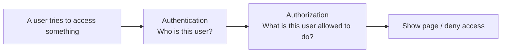
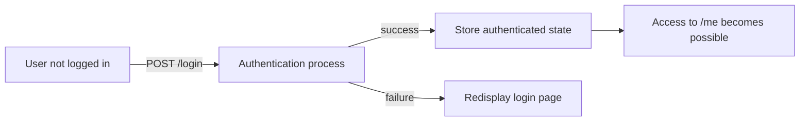
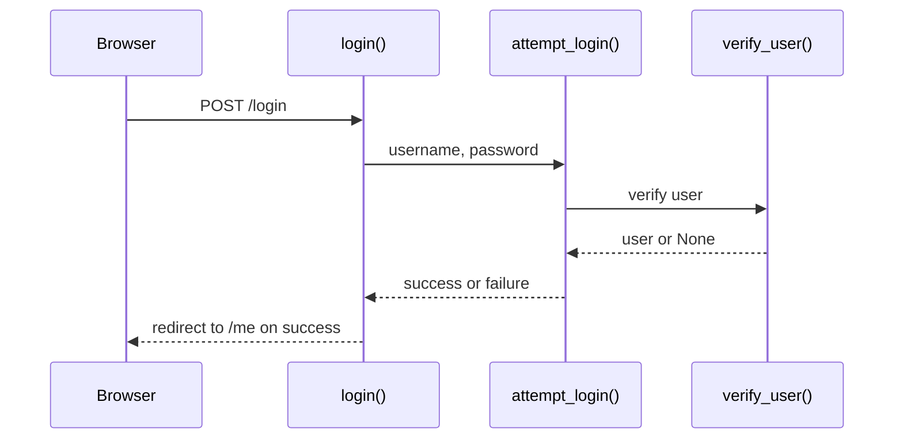
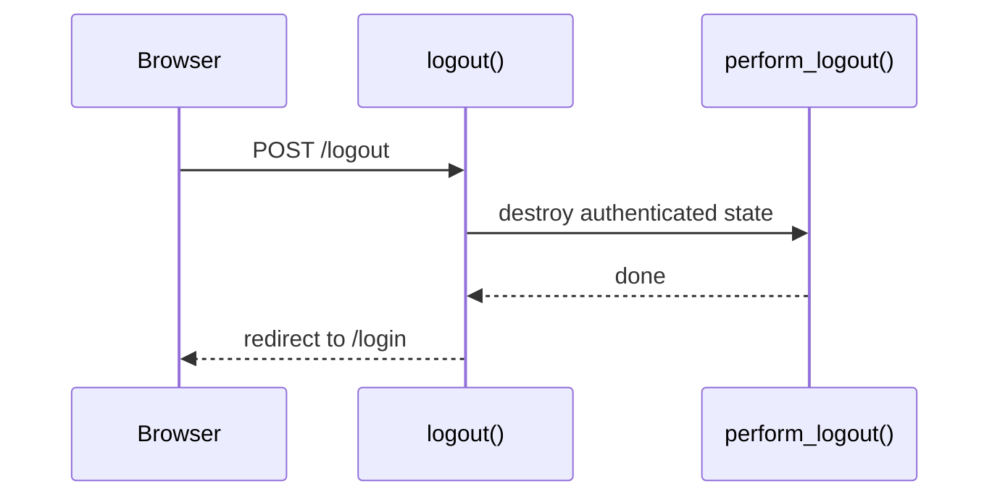
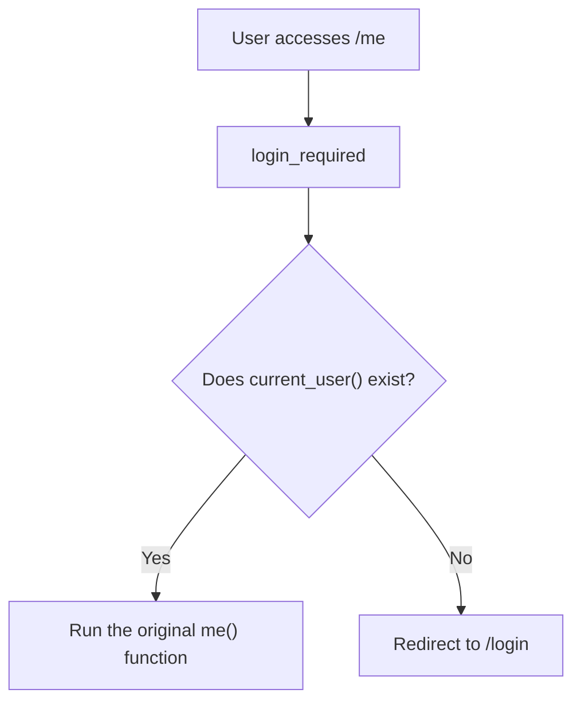
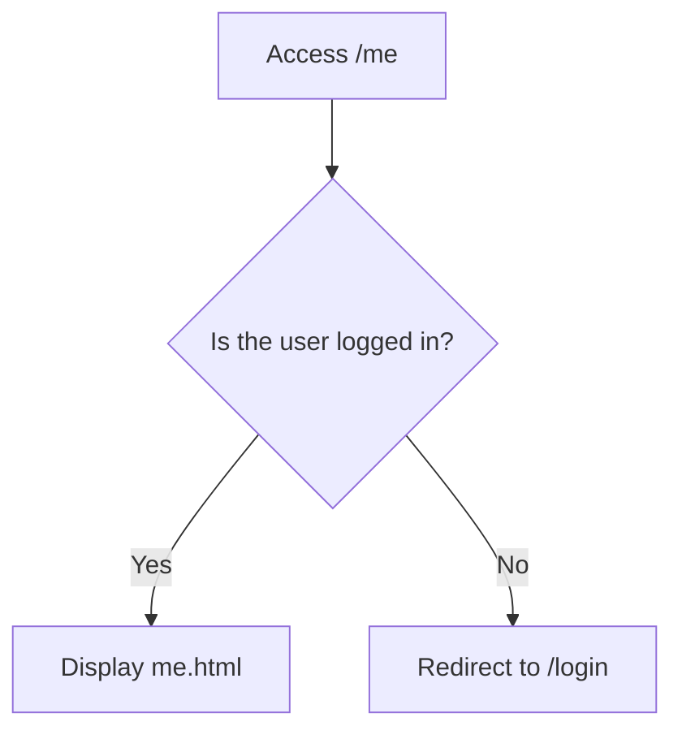
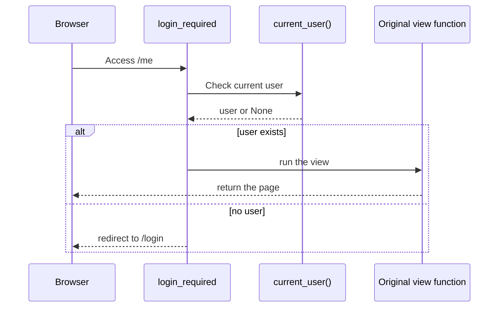

# Lecture 2
## Login, Logout, and Authentication Basics

- Course: Web Application Vulnerability Lab
- Theme: Understanding the basic authentication flow
- Goal: Be able to explain login, logout, and protected pages from the code

---

# Learning Goals for Today

- Explain the difference between authentication and authorization
- Explain the flow of login processing
- Explain the flow of logout processing
- Explain how protected pages are enforced
- Explain the role of `login_required`

---

# Topics for Today

1. Authentication and authorization
2. The login flow
3. The logout flow
4. The idea of protected pages
5. The Flask-side implementation
6. Exercises

---

# Review of Last Time

- A Flask app separates processing by URL
- Routing is written in `routes.py`
- Pages are in `templates/`
- Forms are submitted with `POST`

Today's focus:

- What it means to be logged in
- What happens when a user is not logged in

---

# Authentication and Authorization

- Authentication:
  - Confirming who you are
  - Example: logging in with `alice / alicepass`
- Authorization:
  - Deciding what you are allowed to do
  - Example: only `admin` can view `/admin`

First, it is important to understand authentication clearly.

---

# Relationship Between Authentication and Authorization



Examples:

- Authentication:
  - Can the user log in as `alice`?
- Authorization:
  - Can `alice` access `/admin`?

---

# Main Pages Used Today

- `/login`
  - Login page
- `/logout`
  - Logout processing
- `/me`
  - Page for authenticated users
- `/admin`
  - A small example of authorization

---

# Authentication Image



---

# Overview of the Login Flow

1. Open `/login`
2. Enter a username and password
3. `POST /login` is sent
4. The server authenticates the user
5. If successful, authenticated state is stored
6. The browser moves to `/me`

---

# Sequence Diagram for Successful Login



---

# What Happens When Login Fails?

- Missing input causes an error
- Wrong username or password causes an error
- The login page is displayed again

Important:

- The decision is made on the server side
- The browser alone does not decide success or failure

---

# The Idea of Logout

- Destroy the authenticated state
- After logout, protected pages should no longer be accessible
- The user must log in again to continue

---

# Sequence Diagram for Logout



---

# What Is a Protected Page?

A protected page is:

- A page that cannot be viewed unless the user is logged in

In this app:

- `/me`
- `/profile`
- `/users`
- `/board`
- `/ping`

---

# Image of Protected Page Control



---

# What Happens If You Visit `/me` While Logged Out?



---

# Code Explanation 1
## `app/services/auth_service.py`

```python
def attempt_login(username, password):
    if not username or not password:
        return None, "Username and password are required.", None

    user = verify_user(username, password)
    if user is None:
        return None, "Invalid username or password.", None

    cookie_value = login_user(user)
    return user, None, cookie_value
```

Key points:

- Missing input means failure
- `verify_user()` checks the user
- On success, `login_user(user)` is called

---

# Code Explanation 2
## `/login` in `app/routes.py`

```python
@main_bp.route("/login", methods=["GET", "POST"])
def login():
    if request.method == "POST":
        user, error, cookie_value = attempt_login(
            request.form.get("username", "").strip(),
            request.form.get("password", ""),
        )
        ...
    return render_template("login.html")
```

Key points:

- `GET` displays the page
- `POST` processes authentication
- The same URL can have different roles

---

# Code Explanation 3
## `verify_user()`

```python
def verify_user(username, password):
    user = get_user_by_username(username)
    if user is None or user.password != password:
        return None
    return user
```

Key points:

- Look up the user in the database
- Check whether the password matches
- Return `None` if it does not match

Note:

- This is a simplified implementation for teaching purposes

---

# Code Explanation 4
## `/logout` in `app/routes.py`

```python
@main_bp.post("/logout")
@csrf_protect
def logout():
    cookie_name = perform_logout()
    flash("You have been logged out.", "success")
    response = redirect(url_for("main.login"))
    ...
    return response
```

Key points:

- Logout is handled with `POST /logout`
- `perform_logout()` removes the authenticated state
- The browser is sent back to `/login`

---

# Code Explanation 5
## `login_required`

```python
def login_required(view_func):
    @wraps(view_func)
    def wrapped(*args, **kwargs):
        user = current_user()
        if user is None:
            flash("Please log in first.", "error")
            return redirect(url_for("main.login"))
        return view_func(*args, **kwargs)
```

Key points:

- It checks whether there is a current user
- If there is no user, it sends the browser to `/login`
- If there is a user, the original function continues

---

# Diagram of `login_required`



---

# Meaning of the Decorator

```python
@main_bp.get("/me")
@login_required
def me():
    return render_template("me.html")
```

Meaning:

- `/me` can only be viewed by logged-in users
- If the user is not logged in, execution does not continue into `me()`

---

# What Is Authenticated State?

For today, this understanding is enough.

- The server can tell that the user is already logged in
- That state is used to decide whether protected pages are allowed

In the next class:

- Cookie-based authentication
- Server-session-based authentication

will be compared in detail

---

# Hands-On 1
## Try Login and Logout

1. Open `/login`
2. Log in with correct credentials
3. Check `/me`
4. Log out
5. Open `/me` again

Check:

- Where the browser moves after login
- What changes after logout

---

# Hands-On 2
## Try Login Failures

Try the following.

1. Leave the username empty
2. Leave the password empty
3. Enter a wrong password

Check:

- What message is displayed
- How the page transition differs from a successful login

---

# Hands-On 3
## Check Protected Pages

While logged out, open:

- `/me`
- `/profile`
- `/board`

Then log in and open the same pages again.

Think about:

- Why the result changes
- Which code creates that difference

---

# Exercise 1
## Organize the Role of `/login`

Look at `app/routes.py` and answer:

1. What happens on `GET`
2. What happens on `POST`
3. Where the browser moves after success
4. What happens after failure

---

# Exercise 2
## Read `attempt_login()`

Look at `app/services/auth_service.py` and explain:

1. What happens when input is missing
2. What happens when authentication fails
3. What is returned when authentication succeeds

---

# Exercise 3
## Read `login_required`

Look at `app/auth/decorators.py` and answer:

1. When `current_user()` is called
2. What is returned when the user is not logged in
3. What is returned when the user is logged in

---

# Exercise 4
## Connect Pages and Processing

Write down the following mappings.

| URL | Function | Role |
|---|---|---|
| `/login` |  |  |
| `/logout` |  |  |
| `/me` |  |  |
| `/admin` |  |  |

---

# Summary

- Authentication means confirming who the user is
- Login creates authenticated state
- Logout removes authenticated state
- Protected pages can be controlled by `login_required`
- It is important to read URLs, functions, templates, and authenticated state together

---

# Next Time

- Cookie-based authentication
- Server-session-based authentication
- Comparing ways to keep authenticated state

---

# Homework

1. List 3 functions related to authentication from `app/routes.py`
2. Explain in writing why `/me` cannot be viewed while logged out
3. Describe the difference between authentication and authorization in your own words

---

# Instructor Notes

- In lecture 2, carefully build the idea of authenticated state
- Do not go too deep into cookies and sessions yet
- Show the difference between logged-out and logged-in behavior directly
- If students can read `login_required`, lecture 3 becomes much easier
