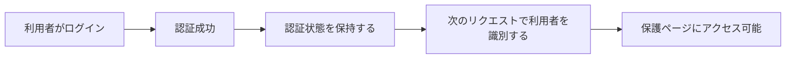
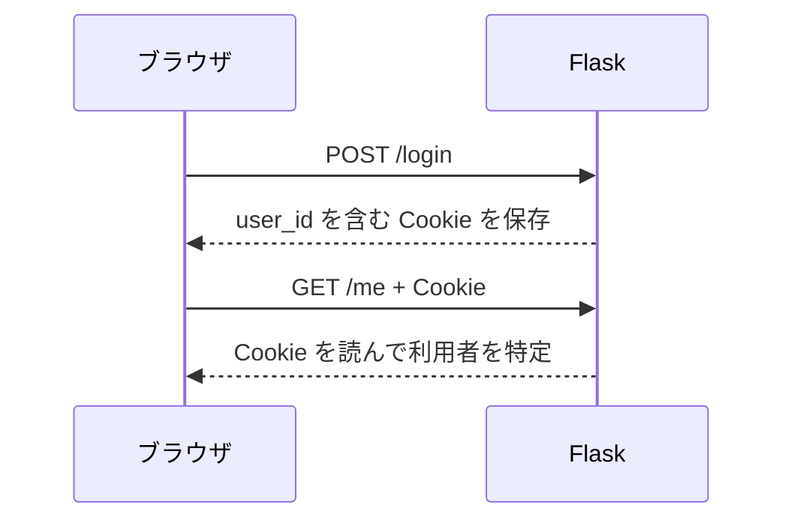
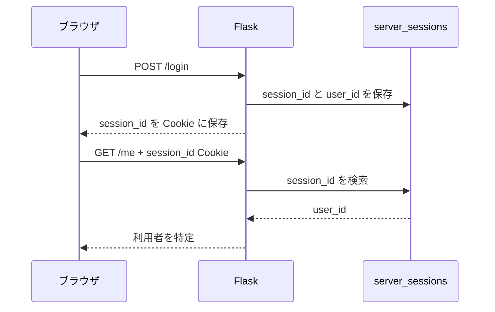
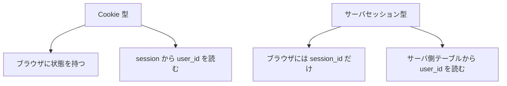

# 第3回
## Cookie 型認証とサーバセッション型認証

- 科目: Web アプリケーション脆弱性演習
- テーマ: 認証状態の保持方法を比較する
- 目標: Cookie 型とサーバセッション型の違いを説明し、コード上の実装箇所を読める

---

# 今日の到達目標

- 認証状態を保持する必要性を説明できる
- Cookie 型認証の考え方を説明できる
- サーバセッション型認証の考え方を説明できる
- 両者の違いを比較できる
- `cookie_auth.py` と `server_session_auth.py` の役割を説明できる

---

# 今日扱う内容

1. 前回の復習
2. なぜ認証状態の保持が必要か
3. Cookie 型認証
4. サーバセッション型認証
5. 実装の比較
6. 演習

---

# 前回の復習

- ログインは認証済み状態を作る
- ログアウトは認証済み状態を消す
- 保護ページは `login_required` で制御する

今回の焦点:

- その「認証済み状態」をどこに持つのか

---

# なぜ認証状態の保持が必要か

HTTP は基本的にステートレスである。

つまり:

- 1 回のリクエストが終わると、そのままでは次のリクエストに状態が残らない
- 何もしないと、毎回「この人は誰か」を確認し直す必要がある

だから:

- 認証状態を保持する仕組みが必要になる

---

# 認証状態保持の全体像



---

# 2つの方式

- Cookie 型認証
  - クライアント側の Cookie を使って認証状態を持つ
- サーバセッション型認証
  - サーバ側に状態を持ち、クライアントには識別子だけを持たせる

この授業では、両方を比較して理解する。

---

# Cookie とは

Cookie:

- ブラウザに保存される小さなデータ
- 次回以降のリクエストで自動的に送られる

講義上のポイント:

- 認証に使える
- セッション管理にも使える
- 設定不備が脆弱性につながる

---

# Cookie 型認証のイメージ



---

# Cookie 型認証の特徴

- 実装が比較的単純
- ブラウザ側に状態がある
- Cookie の内容や属性が重要になる

この教材アプリでは:

- Flask の `session` を利用している
- `user_id` を session に入れている

---

# サーバセッション型認証のイメージ



---

# サーバセッション型認証の特徴

- サーバ側に状態がある
- ブラウザには識別子だけを置く
- セッション ID の管理が重要になる

この教材アプリでは:

- `server_sessions` テーブルを使っている
- ランダムな `session_id` を発行している

---

# 方式の比較

| 観点 | Cookie 型 | サーバセッション型 |
|---|---|---|
| 主な状態の置き場所 | ブラウザ側 | サーバ側 |
| ブラウザに保存するもの | 認証状態に使う値 | セッション ID |
| サーバ側の保存 | 少ない | 必要 |
| 教材として見える点 | Cookie の中身 | サーバ側セッションの対応関係 |

---

# この教材アプリでの切替

- `lab-settings` から認証方式を切り替えられる
- `cookie`
- `server_session`

重要:

- 認証方式を切り替えると強制ログアウトする
- 比較しやすくするための教材設計

---

# コード解説 1
## `get_auth_mode()`

```python
def get_auth_mode():
    cookie_name = current_app.config["AUTH_MODE_COOKIE_NAME"]
    requested_mode = request.cookies.get(cookie_name)
    if requested_mode in {"cookie", "server_session"}:
        return requested_mode
    return current_app.config["DEFAULT_AUTH_MODE"]
```

ポイント:

- 現在どの認証方式を使うか決める
- ブラウザごとの Cookie を見ている
- 既定値も用意されている

---

# コード解説 2
## `get_auth_backend()`

```python
def get_auth_backend():
    mode = get_auth_mode()
    if mode == "server_session":
        return ServerSessionAuthBackend()
    return CookieAuthBackend()
```

ポイント:

- 認証方式に応じて backend を切り替える
- 同じアプリで 2 つの方式を比較できる

---

# コード解説 3
## `cookie_auth.py`

```python
class CookieAuthBackend(AuthBackend):
    def login(self, user):
        session.clear()
        session["auth_mode"] = "cookie"
        session["user_id"] = user.id
        return None
```

ポイント:

- Flask の `session` に `user_id` を保存する
- この教材では Cookie 型認証の例として扱う

---

# Cookie 型の現在ユーザ取得

```python
def get_current_user(self):
    if session.get("auth_mode") != "cookie":
        return None
    user_id = session.get("user_id")
    if user_id is None:
        return None
    return get_user_by_id(user_id)
```

ポイント:

- session から `user_id` を取り出す
- その値を使って利用者を特定する

---

# コード解説 4
## `server_session_auth.py`

```python
class ServerSessionAuthBackend(AuthBackend):
    def login(self, user):
        session.clear()
        server_session_id = create_server_session(user.id)
        return server_session_id
```

ポイント:

- ランダムな session ID を発行する
- サーバ側へ保存する
- ブラウザには ID だけを返す

---

# サーバセッション保存の実装

```python
def create_server_session(user_id):
    session_id = secrets.token_hex(16)
    ...
    conn.execute(
        "INSERT INTO server_sessions (session_id, user_id, created_at) VALUES (?, ?, ?)",
        (session_id, user_id, created_at),
    )
```

ポイント:

- `session_id` はランダム
- `user_id` と対応づけて保存している

---

# サーバセッション型の現在ユーザ取得

```python
def get_current_user(self):
    cookie_name = current_app.config["SERVER_SESSION_COOKIE_NAME"]
    session_id = request.cookies.get(cookie_name)
    if not session_id:
        return None
    row = get_server_session(session_id)
    if row is None:
        return None
    return get_user_by_id(row["user_id"])
```

ポイント:

- ブラウザから session ID を受け取る
- サーバ側テーブルを引く
- その結果から利用者を特定する

---

# `/debug/session` で見るもの

授業では次を観察する。

- 受信した Cookie
- Flask の `session`
- 解決された現在ユーザ

観察の狙い:

- どの方式で何が変わるかを見る

---

# 図で比較する



---

# ハンズオン 1
## `lab-settings` で切り替える

1. `Lab Settings` を開く
2. 認証方式を `cookie` にする
3. ログインして `/debug/session` を開く
4. 内容を確認する
5. 認証方式を `server_session` にする
6. 再ログインして `/debug/session` を開く

---

# ハンズオン 2
## 比較して記録する

次の表を埋める。

| 観察項目 | Cookie 型 | サーバセッション型 |
|---|---|---|
| ブラウザに何があるか |  |  |
| サーバ側で見るもの |  |  |
| 現在ユーザの特定方法 |  |  |

---

# 演習 1
## `cookie_auth.py` を読む

次を答える。

1. `login()` は何を保存しているか
2. `logout()` は何をしているか
3. `get_current_user()` はどうやって利用者を探すか

---

# 演習 2
## `server_session_auth.py` を読む

次を答える。

1. `login()` は何を返しているか
2. `logout()` は何を削除しているか
3. `get_current_user()` はどの値を使って利用者を探すか

---

# 演習 3
## `helpers.py` を読む

次を説明する。

1. `get_auth_mode()` の役割
2. `get_auth_backend()` の役割
3. なぜ backend を分けると教材として分かりやすいか

---

# 演習 4
## 自分の言葉で比較する

次の問いに答える。

1. Cookie 型認証の長所は何か
2. サーバセッション型認証の長所は何か
3. どちらの方式でも Cookie が関係するのはなぜか

---

# 今日のまとめ

- 認証状態の保持には仕組みが必要
- Cookie 型はブラウザ側の状態を使う
- サーバセッション型はサーバ側の状態を使う
- この教材では両者を backend で分離して比較している
- `/debug/session` と `lab-settings` を使うと差が見やすい

---

# 次回予告

- Cookie 属性
- Session 管理の不備
- 認証周辺の脆弱性の入口

---

# 宿題

1. Cookie 型とサーバセッション型の違いを 3 点書く
2. `cookie_auth.py` と `server_session_auth.py` の共通点を 2 点書く
3. `/debug/session` で何を観察すべきか説明する

---

# 教員メモ

- 「Cookie 型」と「サーバセッション型」を対立ではなく比較対象として扱う
- どちらも Cookie を使うが、役割が違うことを強調する
- 実際に `lab-settings` と `/debug/session` を開いて見せる
- 次回の Cookie 属性やセッション管理不備につなげる
