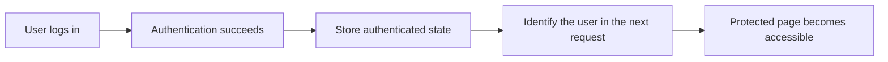
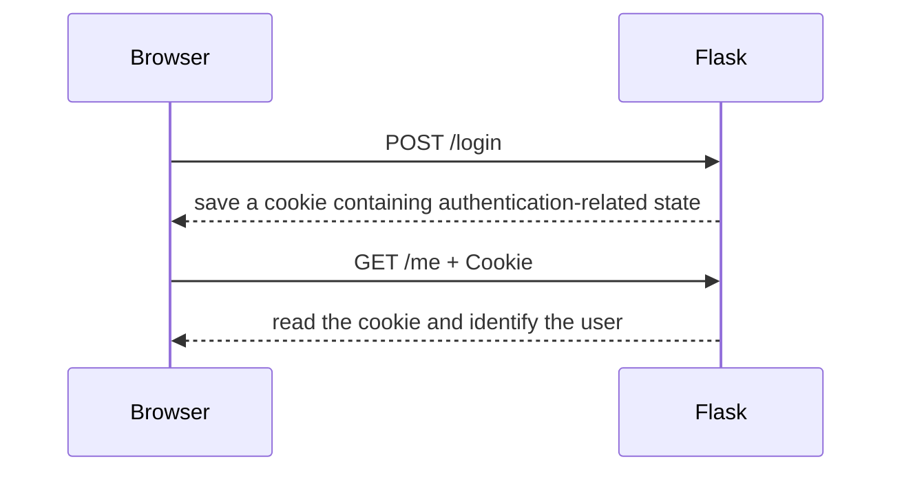
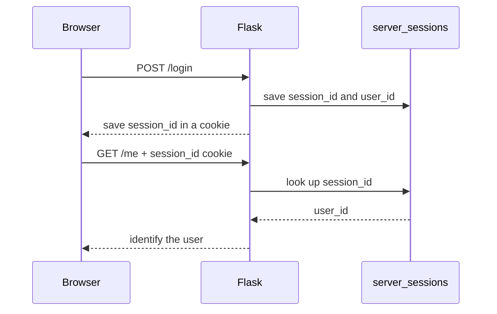
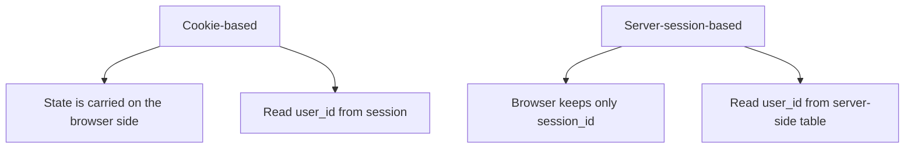

# Lecture 3
## Cookie-Based and Server-Session-Based Authentication

- Course: Web Application Vulnerability Lab
- Theme: Comparing ways to keep authentication state
- Goal: Explain the difference between cookie-based and server-session-based authentication and read the related code

---

# Learning Goals for Today

- Explain why authentication state must be preserved
- Explain the idea of cookie-based authentication
- Explain the idea of server-session-based authentication
- Compare the two approaches
- Explain the roles of `cookie_auth.py` and `server_session_auth.py`

---

# Topics for Today

1. Review of the previous class
2. Why state preservation is needed
3. Cookie-based authentication
4. Server-session-based authentication
5. Comparing the implementations
6. Exercises

---

# Review of Last Time

- Login creates authenticated state
- Logout removes authenticated state
- Protected pages are controlled by `login_required`

Today's focus:

- Where that authenticated state is stored

---

# Why Do We Need Authentication State?

HTTP is basically stateless.

That means:

- After one request ends, the next request does not automatically remember it
- Without additional handling, the server would need to identify the user again every time

So:

- We need a mechanism to preserve authenticated state

---

# Overall Image of State Preservation



---

# Two Approaches

- Cookie-based authentication
  - Uses client-side cookies to keep authentication-related state
- Server-session-based authentication
  - Keeps state on the server and stores only an identifier on the client

In this class, we compare both approaches.

---

# What Is a Cookie?

A cookie is:

- Small data stored by the browser
- Automatically sent with later requests

Important for this course:

- It can be used for authentication
- It is also used in session management
- Bad cookie handling can lead to vulnerabilities

---

# Image of Cookie-Based Authentication



---

# Characteristics of Cookie-Based Authentication

- Relatively simple to implement
- The browser carries the state
- Cookie contents and attributes matter

In this teaching app:

- Flask `session` is used
- `user_id` is stored in the session

---

# Image of Server-Session-Based Authentication



---

# Characteristics of Server-Session-Based Authentication

- State is kept on the server side
- The browser stores only an identifier
- Session ID management becomes important

In this teaching app:

- The `server_sessions` table is used
- A random `session_id` is generated

---

# Comparison

| Viewpoint | Cookie-Based | Server-Session-Based |
|---|---|---|
| Main place where state exists | Browser side | Server side |
| What is stored in the browser | Authentication-related value | Session ID |
| Server-side storage | Small or minimal | Required |
| Easy to observe in class | Cookie content | Server-side mapping |

---

# Switching in This App

- Authentication mode can be changed from `lab-settings`
- `cookie`
- `server_session`

Important:

- Changing the authentication mode forces logout
- This is part of the teaching design so comparison is easier

---

# Code Explanation 1
## `get_auth_mode()`

```python
def get_auth_mode():
    cookie_name = current_app.config["AUTH_MODE_COOKIE_NAME"]
    requested_mode = request.cookies.get(cookie_name)
    if requested_mode in {"cookie", "server_session"}:
        return requested_mode
    return current_app.config["DEFAULT_AUTH_MODE"]
```

Key points:

- Decides which authentication mode is currently active
- Checks a browser-side cookie
- Also supports a default mode

---

# Code Explanation 2
## `get_auth_backend()`

```python
def get_auth_backend():
    mode = get_auth_mode()
    if mode == "server_session":
        return ServerSessionAuthBackend()
    return CookieAuthBackend()
```

Key points:

- Switches backends depending on the authentication mode
- Makes it possible to compare both approaches in one app

---

# Code Explanation 3
## `cookie_auth.py`

```python
class CookieAuthBackend(AuthBackend):
    def login(self, user):
        session.clear()
        session["auth_mode"] = "cookie"
        session["user_id"] = user.id
        return None
```

Key points:

- Stores `user_id` in Flask `session`
- In this teaching app, this is treated as the cookie-based example

---

# Current User Resolution in Cookie Mode

```python
def get_current_user(self):
    if session.get("auth_mode") != "cookie":
        return None
    user_id = session.get("user_id")
    if user_id is None:
        return None
    return get_user_by_id(user_id)
```

Key points:

- Reads `user_id` from the session
- Uses that value to identify the user

---

# Code Explanation 4
## `server_session_auth.py`

```python
class ServerSessionAuthBackend(AuthBackend):
    def login(self, user):
        session.clear()
        server_session_id = create_server_session(user.id)
        return server_session_id
```

Key points:

- Generates a random session ID
- Saves it on the server side
- Returns only the ID to the browser

---

# Server-Side Session Storage

```python
def create_server_session(user_id):
    session_id = secrets.token_hex(16)
    ...
    conn.execute(
        "INSERT INTO server_sessions (session_id, user_id, created_at) VALUES (?, ?, ?)",
        (session_id, user_id, created_at),
    )
```

Key points:

- `session_id` is random
- It is stored together with `user_id`

---

# Current User Resolution in Server-Session Mode

```python
def get_current_user(self):
    cookie_name = current_app.config["SERVER_SESSION_COOKIE_NAME"]
    session_id = request.cookies.get(cookie_name)
    if not session_id:
        return None
    row = get_server_session(session_id)
    if row is None:
        return None
    return get_user_by_id(row["user_id"])
```

Key points:

- Receives the session ID from the browser
- Looks it up in the server-side table
- Uses the result to identify the user

---

# What to Observe in `/debug/session`

In class, observe:

- Received cookies
- Flask `session`
- The resolved current user

Purpose:

- To see what changes between the two modes

---

# Visual Comparison



---

# Hands-On 1
## Switch from `lab-settings`

1. Open `Lab Settings`
2. Set the authentication mode to `cookie`
3. Log in and open `/debug/session`
4. Observe the contents
5. Change the mode to `server_session`
6. Log in again and open `/debug/session`

---

# Hands-On 2
## Compare and Record

Fill in the table.

| Observation | Cookie-Based | Server-Session-Based |
|---|---|---|
| What exists in the browser |  |  |
| What the server checks |  |  |
| How the current user is resolved |  |  |

---

# Exercise 1
## Read `cookie_auth.py`

Answer:

1. What does `login()` store?
2. What does `logout()` do?
3. How does `get_current_user()` find the user?

---

# Exercise 2
## Read `server_session_auth.py`

Answer:

1. What does `login()` return?
2. What does `logout()` remove?
3. Which value does `get_current_user()` use to find the user?

---

# Exercise 3
## Read `helpers.py`

Explain:

1. The role of `get_auth_mode()`
2. The role of `get_auth_backend()`
3. Why separating backends makes the app easier to understand as teaching material

---

# Exercise 4
## Compare in Your Own Words

Answer:

1. What is one advantage of cookie-based authentication?
2. What is one advantage of server-session-based authentication?
3. Why are cookies still involved in both approaches?

---

# Summary

- Authentication state needs a preservation mechanism
- Cookie-based mode uses browser-side state
- Server-session-based mode uses server-side state
- This app separates the two approaches with different backends
- `lab-settings` and `/debug/session` make the difference easier to observe

---

# Next Time

- Cookie attributes
- Session management problems
- Entry points to authentication-related vulnerabilities

---

# Homework

1. Write three differences between cookie-based and server-session-based authentication
2. Write two similarities between `cookie_auth.py` and `server_session_auth.py`
3. Explain what should be observed on `/debug/session`

---

# Instructor Notes

- Present cookie-based and server-session-based authentication as comparison targets, not enemies
- Emphasize that both approaches still involve cookies, but the role of the cookie is different
- Open `lab-settings` and `/debug/session` live during class
- Connect this lecture to the next one on cookie attributes and session-management issues
