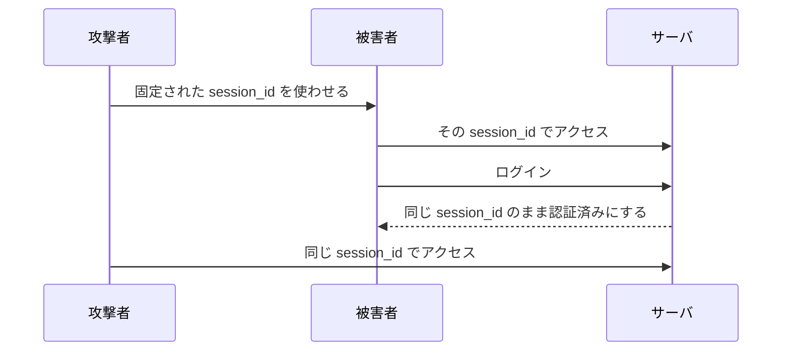
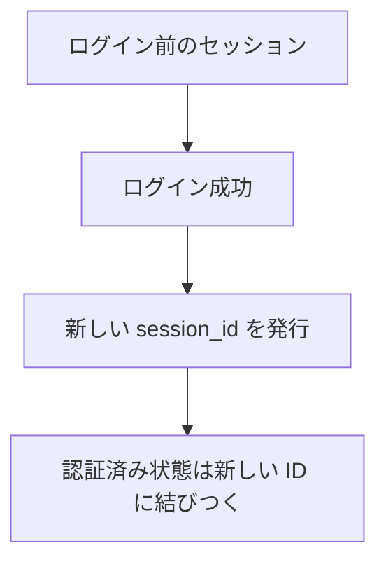
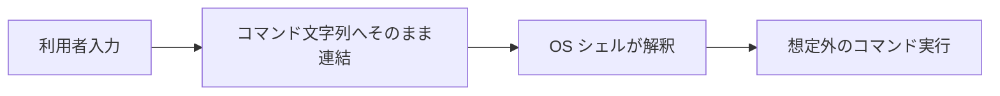
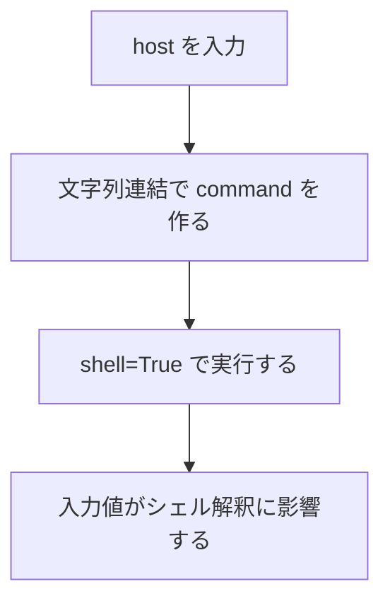

# 第6回
## セッション固定とコマンドインジェクション

- 科目: Web アプリケーション脆弱性演習
- テーマ: セッション管理不備と OS コマンド実行の危険性を理解する
- 目標: セッション固定とコマンドインジェクションの原理、危険な実装、基本対策を説明できる

---

# 今日の到達目標

- セッション固定とは何か説明できる
- なぜログイン時のセッション管理が重要か説明できる
- コマンドインジェクションとは何か説明できる
- なぜ `shell=True` と文字列連結が危険か説明できる
- `/ping` の safe / vulnerable を比較できる

---

# 今日扱う内容

1. 前回の復習
2. セッション固定
3. セッション ID の扱い
4. コマンドインジェクション
5. 教材アプリでの比較
6. 演習

---

# 前回の復習

- XSS は危険な出力によるスクリプト実行
- CSRF はログイン済みブラウザを悪用した意図しないリクエスト送信
- 出力の安全性とリクエストの正当性確認が重要

今回の焦点:

- セッションの作り方
- OS コマンドの実行方法

---

# セッション固定とは

セッション固定:

- 攻撃者が知っている、または指定したセッション ID を被害者に使わせる問題

危険な流れ:

1. 攻撃者がセッション ID を用意する
2. 被害者がその ID を使ったままログインする
3. 攻撃者が同じ ID を使って被害者になりすます

---

# セッション固定のイメージ



---

# なぜ危険か

- ログイン前の状態とログイン後の状態が同じ識別子で結びつく
- セッション ID を知っている第三者が認証済み状態を悪用できる

基本対策:

- ログイン時に新しいセッション ID を発行する

---

# この教材アプリとセッション固定

サーバセッション型では:

```python
def login(self, user):
    session.clear()
    server_session_id = create_server_session(user.id)
    return server_session_id
```

ポイント:

- ログイン時に新しい `server_session_id` を生成している
- これは固定化を避ける方向の実装である

---

# session_id 生成の実装

```python
def create_server_session(user_id):
    session_id = secrets.token_hex(16)
    ...
    conn.execute(
        "INSERT INTO server_sessions (session_id, user_id, created_at) VALUES (?, ?, ?)",
        (session_id, user_id, created_at),
    )
```

ポイント:

- ランダムな ID を新規作成している
- 既存の ID を流用していない

---

# セッション固定を避ける考え方



---

# コマンドインジェクションとは

コマンドインジェクション:

- 利用者入力が OS コマンドの一部として解釈されてしまう問題

主な原因:

- 文字列連結でコマンドを作る
- `shell=True` で実行する

---

# コマンドインジェクションのイメージ



---

# 教材アプリで使うページ

- `/ping`
  - ホスト名を入力して `ping` を実行する
- `lab-settings`
  - `Command injection mode`
    - `safe`
    - `vulnerable`

---

# 安全な実装

```python
def safe_ping(host):
    if not host or not HOST_PATTERN.fullmatch(host):
        return False, "Invalid host."

    result = subprocess.run(
        ["ping", "-c", "1", host],
        capture_output=True,
        text=True,
        timeout=5,
        check=False,
    )
```

ポイント:

- 入力値を検証している
- リスト形式でコマンドを渡している
- `shell=True` を使っていない

---

# 脆弱な実装

```python
def unsafe_ping(host):
    command = f"ping -c 1 {host}"
    result = subprocess.run(
        command,
        capture_output=True,
        text=True,
        timeout=5,
        shell=True,
        check=False,
    )
```

ポイント:

- 入力値をそのまま連結している
- `shell=True` を使っている

---

# なぜ危険か



---

# `/ping` の表示

`/ping` では次を観察できる。

- Execution mode
- 入力した host
- 実行結果
- vulnerable のときは `Executed command`

狙い:

- 入力がコマンド文字列にどう入るかを見る

---

# safe と vulnerable の比較

| 観点 | safe | vulnerable |
|---|---|---|
| 入力検証 | あり | なし |
| 実行方法 | リスト引数 | 文字列連結 |
| `shell=True` | なし | あり |
| 危険性 | 低い | 高い |

---

# コード解説 1
## `/ping` の切替

```python
if command_injection_enabled():
    success, output, executed_command = unsafe_ping(host)
else:
    success, output = safe_ping(host)
```

ポイント:

- `lab-settings` の状態で実装を切り替える
- 同じ画面で差を比較できる

---

# コード解説 2
## `ping.html`

```html

<p>Executed command:</p>
<pre>{{ executed_command }}</pre>

```

ポイント:

- 脆弱版では実行されたコマンド文字列を見せる
- 入力値がどう連結されるか観察できる

---

# セッション固定とコマンドインジェクションの違い

| 観点 | セッション固定 | コマンドインジェクション |
|---|---|---|
| 主な問題 | セッション ID の使い回し | OS コマンド文字列の汚染 |
| 主な場所 | 認証・セッション管理 | サーバ側入力処理 |
| 基本対策 | ログイン時の ID 再生成 | 入力検証と `shell=False` |

---

# ハンズオン 1
## `/ping` の safe を確認する

1. `Lab Settings` を開く
2. `Command injection mode` を `safe` にする
3. `/ping` を開く
4. ホスト名を入力して実行する

確認すること:

- 実行結果
- 入力制約
- `Executed command` が出るか

---

# ハンズオン 2
## `/ping` の vulnerable を確認する

1. `Lab Settings` を開く
2. `Command injection mode` を `vulnerable` にする
3. `/ping` を開く
4. safe と違いを観察する

確認すること:

- `Executed command` が表示されるか
- なぜ危険か説明できるか

---

# ハンズオン 3
## セッション固定を考える

次を考える。

1. ログイン前のセッション ID をそのまま使うと何が危険か
2. なぜログイン時に新しい ID を作るべきか
3. 今の教材アプリはどちらに近いか

---

# 演習 1
## `unsafe_ping()` を読む

次を答える。

1. どこでコマンド文字列を作っているか
2. なぜ `shell=True` が危険か
3. どこが safe と違うか

---

# 演習 2
## `safe_ping()` を読む

次を答える。

1. 入力検証はどこでしているか
2. なぜリスト形式で渡すのか
3. なぜ危険性が下がるのか

---

# 演習 3
## サーバセッション実装を読む

次を答える。

1. `create_server_session()` は何をしているか
2. なぜランダムな session ID が必要か
3. セッション固定を防ぐには何が重要か

---

# 演習 4
## 自分の言葉で説明する

次の問いに答える。

1. セッション固定の本質は何か
2. コマンドインジェクションの本質は何か
3. 2つの問題はどこが違うか

---

# 今日のまとめ

- セッション固定は認証済み状態と session ID の結びつけ方の問題
- ログイン時に新しい session ID を発行することが重要
- コマンドインジェクションは入力値が OS コマンドの構造に影響する問題
- `shell=True` と文字列連結は危険である
- `/ping` とサーバセッション実装を読むことで差が見える

---

# 次回予告

- 認可不備
- 総合演習
- これまでの脆弱性の整理

---

# 宿題

1. safe_ping と unsafe_ping の違いを 3 点書く
2. セッション固定を防ぐために必要なことを書く
3. `shell=True` が危険な理由を文章で書く

---

# 教員メモ

- セッション固定は概念が抽象的なので図で丁寧に説明する
- 今の実装が「比較的安全側」であることを示すと理解しやすい
- コマンドインジェクションは `/ping` の差分が非常に見せやすい
- 最終回の総合演習につなげるため、入力処理とセッション管理を整理する
