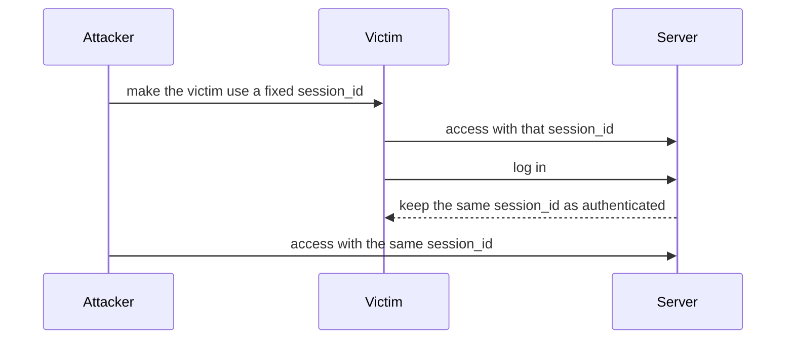
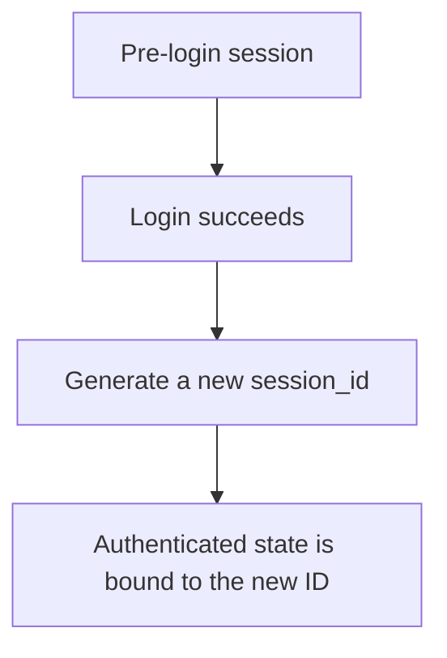
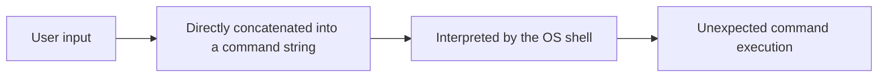
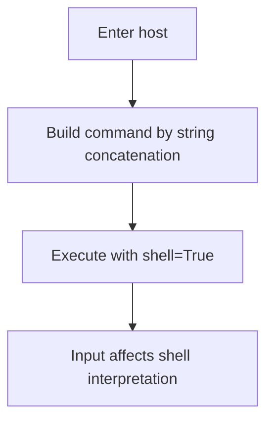

# Lecture 6
## Session Fixation and Command Injection

- Course: Web Application Vulnerability Lab
- Theme: Understanding session-management flaws and the danger of OS command execution
- Goal: Explain the principles, dangerous implementations, and basic defenses of session fixation and command injection

---

# Learning Goals for Today

- Explain what session fixation is
- Explain why session handling at login is important
- Explain what command injection is
- Explain why string concatenation and `shell=True` are dangerous
- Compare safe and vulnerable behavior on `/ping`

---

# Topics for Today

1. Review of the previous class
2. Session fixation
3. Handling session IDs
4. Command injection
5. Comparison in the teaching app
6. Exercises

---

# Review of Last Time

- XSS is a script-execution problem caused by dangerous output
- CSRF abuses a logged-in browser for unintended requests
- Safe output and request validation are important

Today's focus:

- How sessions are created
- How OS commands are executed

---

# What Is Session Fixation?

Session fixation:

- A problem where the victim is made to use a session ID already known or chosen by an attacker

Dangerous flow:

1. The attacker prepares a session ID
2. The victim logs in while still using that ID
3. The attacker reuses the same ID to act as the victim

---

# Image of Session Fixation



---

# Why Is It Dangerous?

- The pre-login state and post-login state are tied to the same identifier
- Anyone who knows that session ID may abuse the authenticated state

Basic defense:

- Generate a new session ID at login

---

# Session Fixation and This Teaching App

In server-session mode:

```python
def login(self, user):
    session.clear()
    server_session_id = create_server_session(user.id)
    return server_session_id
```

Key points:

- A new `server_session_id` is generated at login
- This is closer to the safer direction

---

# Session ID Generation in the Code

```python
def create_server_session(user_id):
    session_id = secrets.token_hex(16)
    ...
    conn.execute(
        "INSERT INTO server_sessions (session_id, user_id, created_at) VALUES (?, ?, ?)",
        (session_id, user_id, created_at),
    )
```

Key points:

- The ID is random
- An existing ID is not reused

---

# Idea for Preventing Session Fixation



---

# What Is Command Injection?

Command injection:

- A problem where user input is interpreted as part of an OS command

Typical causes:

- Building a command through string concatenation
- Executing it with `shell=True`

---

# Image of Command Injection



---

# Pages Used in This Teaching App

- `/ping`
  - Takes a host name and runs `ping`
- `lab-settings`
  - `Command injection mode`
    - `safe`
    - `vulnerable`

---

# Safe Implementation

```python
def safe_ping(host):
    if not host or not HOST_PATTERN.fullmatch(host):
        return False, "Invalid host."

    result = subprocess.run(
        ["ping", "-c", "1", host],
        capture_output=True,
        text=True,
        timeout=5,
        check=False,
    )
```

Key points:

- Input is validated
- The command is passed as a list
- `shell=True` is not used

---

# Vulnerable Implementation

```python
def unsafe_ping(host):
    command = f"ping -c 1 {host}"
    result = subprocess.run(
        command,
        capture_output=True,
        text=True,
        timeout=5,
        shell=True,
        check=False,
    )
```

Key points:

- Input is concatenated directly
- `shell=True` is used

---

# Why Is It Dangerous?



---

# What `/ping` Shows

On `/ping`, students can observe:

- Execution mode
- The input host
- Command output
- `Executed command` in vulnerable mode

Purpose:

- To see how input enters the command string

---

# Comparison of Safe and Vulnerable Modes

| Viewpoint | safe | vulnerable |
|---|---|---|
| Input validation | Yes | No |
| Execution style | List arguments | String concatenation |
| `shell=True` | No | Yes |
| Risk | Lower | Higher |

---

# Code Explanation 1
## Switching in `/ping`

```python
if command_injection_enabled():
    success, output, executed_command = unsafe_ping(host)
else:
    success, output = safe_ping(host)
```

Key points:

- `lab-settings` switches the implementation
- The same page can be used for comparison

---

# Code Explanation 2
## `ping.html`

```html

<p>Executed command:</p>
<pre>{{ executed_command }}</pre>

```

Key points:

- Vulnerable mode shows the executed command string
- Students can observe how input is concatenated

---

# Difference Between Session Fixation and Command Injection

| Viewpoint | Session Fixation | Command Injection |
|---|---|---|
| Main problem | Reusing a session ID | Polluting an OS command string |
| Main area | Authentication / session management | Server-side input handling |
| Basic defense | Regenerate ID at login | Validate input and avoid `shell=True` |

---

# Hands-On 1
## Check `/ping` in Safe Mode

1. Open `Lab Settings`
2. Set `Command injection mode` to `safe`
3. Open `/ping`
4. Enter a host name and run it

Check:

- The output
- Input restrictions
- Whether `Executed command` appears

---

# Hands-On 2
## Check `/ping` in Vulnerable Mode

1. Open `Lab Settings`
2. Set `Command injection mode` to `vulnerable`
3. Open `/ping`
4. Observe how it differs from safe mode

Check:

- Whether `Executed command` is displayed
- Whether you can explain why it is dangerous

---

# Hands-On 3
## Think About Session Fixation

Think about the following.

1. What is dangerous about reusing the same session ID after login?
2. Why should a new ID be created at login?
3. Which side is the current app closer to?

---

# Exercise 1
## Read `unsafe_ping()`

Answer:

1. Where is the command string built?
2. Why is `shell=True` dangerous?
3. How does it differ from the safe version?

---

# Exercise 2
## Read `safe_ping()`

Answer:

1. Where is the input validated?
2. Why is the command passed as a list?
3. Why does that reduce risk?

---

# Exercise 3
## Read the Server-Session Implementation

Answer:

1. What does `create_server_session()` do?
2. Why is a random session ID necessary?
3. What is important to prevent session fixation?

---

# Exercise 4
## Explain in Your Own Words

Answer:

1. What is the core problem in session fixation?
2. What is the core problem in command injection?
3. How are these two problems different?

---

# Summary

- Session fixation is a problem in how authenticated state is tied to a session ID
- A new session ID should be generated at login
- Command injection happens when input affects the structure of an OS command
- String concatenation and `shell=True` are dangerous
- The differences can be observed through `/ping` and the server-session code

---

# Next Time

- Broken authorization
- Final integrated exercises
- Organizing everything learned so far

---

# Homework

1. Write three differences between `safe_ping` and `unsafe_ping`
2. Write what is needed to prevent session fixation
3. Explain in writing why `shell=True` is dangerous

---

# Instructor Notes

- Session fixation is abstract, so use diagrams carefully
- It helps to show that the current implementation is relatively on the safer side
- Command injection is easy to demonstrate through the `/ping` difference
- Connect this lecture to the final integrated exercises by organizing input handling and session management
