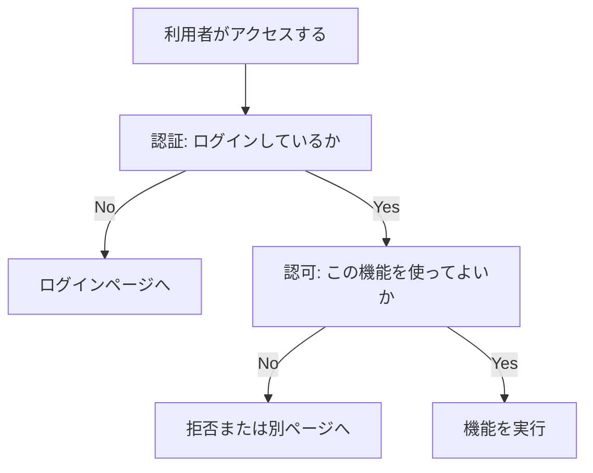
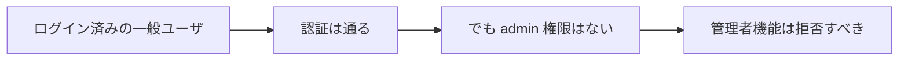
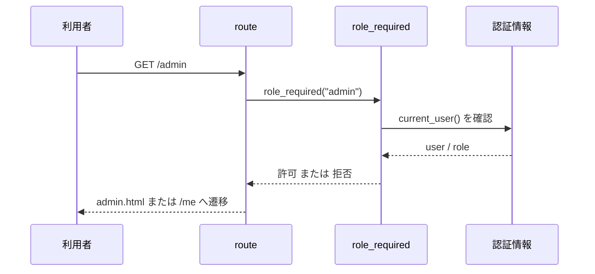
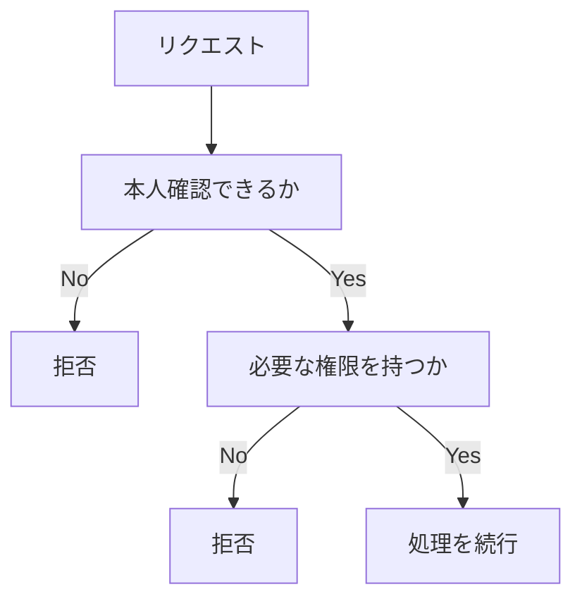
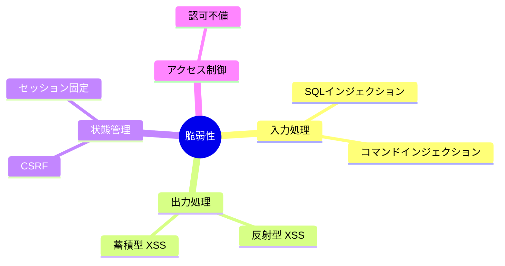
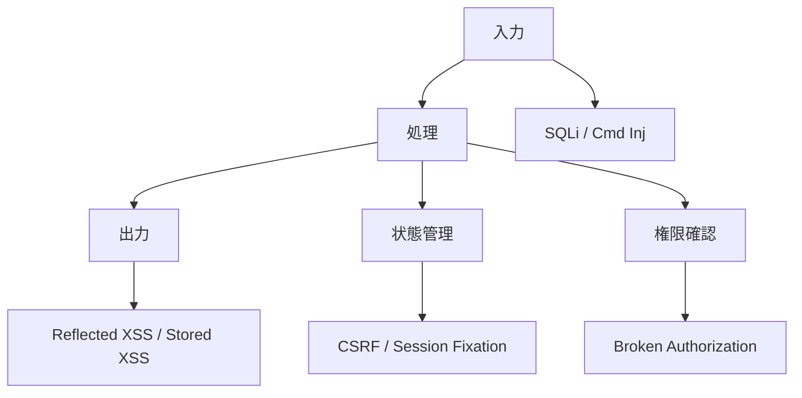

# 第7回
## 認可不備・総合演習・まとめ

- 科目: Web アプリケーション脆弱性演習
- テーマ: 認可不備を理解し、ここまで学んだ脆弱性を整理する
- 目標: 認可不備の原理、アクセス制御の重要性、各脆弱性の関係を説明できる

---

# 今日の到達目標

- 認証と認可の違いを説明できる
- 認可不備がなぜ危険か説明できる
- `/admin` と `role_required` の役割を説明できる
- これまで扱った脆弱性を分類できる
- どの対策がどの問題に効くか整理できる

---

# 今日扱う内容

1. ここまでの復習
2. 認可不備の基本
3. 教材アプリの `/admin`
4. `role_required` のコード解説
5. 総合演習
6. まとめ

---

# 前回の復習

- セッション固定は認証後も同じ識別子を使い続ける危険
- コマンドインジェクションは入力値が OS コマンドに影響する問題
- 状態管理と安全な API 利用が重要

今日の焦点:

- 誰がアクセスできるか
- どこで権限を確認するか

---

# 認証と認可

- 認証
  - あなたは誰か
- 認可
  - あなたは何をしてよいか

例:

- `admin` であることを確認するのは認可
- ログイン済みかを確認するのは認証

---

# 認証と認可の関係



---

# 認証だけでは足りない



---

# 認可不備とは

認可不備:

- 本来アクセスできない機能やデータにアクセスできてしまう問題

例:

- 一般ユーザが管理者ページを開ける
- 他人のデータを編集できる
- URL を変えるだけで権限の高い操作ができる

---

# なぜ危険か

- ログインしていても安全とは限らない
- 「ログイン済み」だけでは管理者機能を守れない
- 機密情報の漏えい
- 不正な更新や削除

重要:

- 認証のあとに認可が必要

---

# 教材アプリの対象ページ

- `/admin`
  - 管理者だけが見られる想定のページ
- `/me`
  - ログイン済みなら見られるページ

比較:

- `/me` は認証だけ
- `/admin` は認証に加えて認可が必要

---

# `/admin` へのアクセスの流れ



---

# `/admin` のルート

```python
@main_bp.get("/admin")
@role_required("admin")
def admin():
    return render_template("admin.html")
```

ポイント:

- `@role_required("admin")` が付いている
- ルート本体は単純でも、前段のチェックが重要

---

# `role_required` の実装

```python
def role_required(required_role):
    def decorator(view):
        @wraps(view)
        def wrapped_view(*args, **kwargs):
            user = current_user()
            if user is None:
                return redirect(url_for("main.login"))
            if user.role != required_role:
                flash("You do not have permission to access that page.")
                return redirect(url_for("main.me"))
            return view(*args, **kwargs)
        return wrapped_view
    return decorator
```

---

# コードの読みどころ

- `user is None`
  - 未ログインならログイン画面へ
- `user.role != required_role`
  - ロールが違えば拒否
- `return view(...)`
  - 条件を満たしたときだけ本体を実行

つまり:

- 「ログイン済み」だけでは通さない

---

# アクセス制御の考え方



---

# 認可不備の典型例

- 管理者ページにロール確認がない
- URL を知っていれば誰でも開ける
- フロントエンドだけで非表示にして満足している
- サーバ側で所有者確認をしていない

注意:

- ボタンを隠すだけでは防げない

---

# ここまでの脆弱性を整理する

| 脆弱性 | 主な問題の場所 |
|---|---|
| SQLインジェクション | 入力値を SQL に組み込む処理 |
| 反射型 XSS | 応答への出力 |
| 蓄積型 XSS | 保存データの表示 |
| CSRF | 状態変更リクエストの正当性確認 |
| セッション固定 | 認証前後の状態管理 |
| コマンドインジェクション | OS コマンド呼び出し |
| 認可不備 | 権限チェック |

---

# 4つの観点で分類する



---

# 全体をつなげて考える



---

# 対策も整理できる

| 観点 | 基本対策 |
|---|---|
| 入力処理 | 文字列連結を避ける、安全な API を使う |
| 出力処理 | 自動エスケープを維持する |
| 状態管理 | CSRF トークン、セッション再生成、適切な Cookie 設定 |
| アクセス制御 | サーバ側で権限を確認する |

---

# 教材アプリの対応表

| ページ / 機能 | 主な学習内容 |
|---|---|
| `/login`, `/logout`, `/me` | 認証 |
| `/lab-settings`, `/debug/session` | 認証方式と状態観察 |
| `/users` | SQLインジェクション |
| `/reflect` | 反射型 XSS |
| `/board` | 蓄積型 XSS |
| `csrf_demo_server.py` | CSRF |
| `/ping` | コマンドインジェクション |
| `/admin` | 認可不備 |

---

# 総合演習 1
## 認可を確認する

手順:

1. `alice` でログインする
2. `/admin` にアクセスする
3. どうなるか確認する
4. `admin` でログインし直す
5. もう一度 `/admin` にアクセスする

観察ポイント:

- 誰が通るか
- どこで止められるか

---

# 総合演習 2
## 脆弱性を分類する

各機能を次のどれに分類するか考える。

- 入力処理
- 出力処理
- 状態管理
- アクセス制御

対象:

- `/users`
- `/reflect`
- `/board`
- `/logout`
- `/ping`
- `/admin`

---

# 総合演習 3
## 対策を対応づける

次の対策がどの問題に効くか考える。

- プレースホルダ
- 自動エスケープ
- CSRF トークン
- セッション ID の再生成
- `shell=False`
- `role_required`

---

# コード読解の観点

コードを読むときは次を確認する。

1. 入力値はどこから来るか
2. どこで加工されるか
3. どこで出力または実行されるか
4. ログイン状態や権限はどこで確認するか

---

# この授業で学んだこと

- Web アプリは入力・出力・状態管理・アクセス制御の組合せで動く
- 脆弱性は 1 箇所だけの問題ではなく、設計の問題として現れる
- 対策は「特別な魔法」ではなく、基本を守ることの積み重ね

---

# まとめ

- 認可不備は「誰でも使えてはいけない機能」を守れない問題
- 認証のあとに認可が必要
- これまで学んだ脆弱性は、観点ごとに整理すると理解しやすい
- 安全な実装は、入力・出力・状態・権限を丁寧に扱うことから始まる

---

# 今後の学習のヒント

- 同じ機能を別フレームワークで作って比較する
- Burp Suite やブラウザ開発者ツールで HTTP を観察する
- 安全な実装例と脆弱な実装例を並べて読む
- 自分で小さな機能を追加して、どこにリスクが入るか考える

---

# 最終課題の例

- `/admin` のような保護対象ページを 1 つ追加する
- どの権限が必要か設計する
- サーバ側で保護する
- 想定される脆弱性と対策を短く説明する

---

# おつかれさまでした

- ここまでで、基本的な Web アプリ脆弱性の土台を一通り学んだ
- 大事なのは「なぜ危険か」と「どこを直すべきか」を結びつけること
