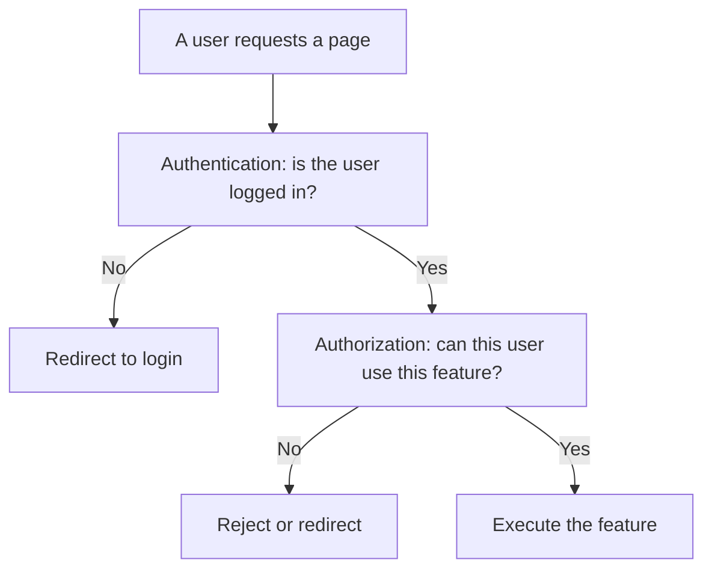
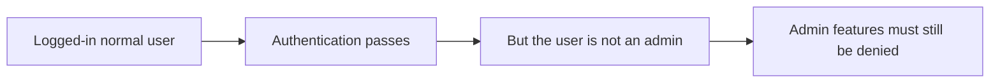
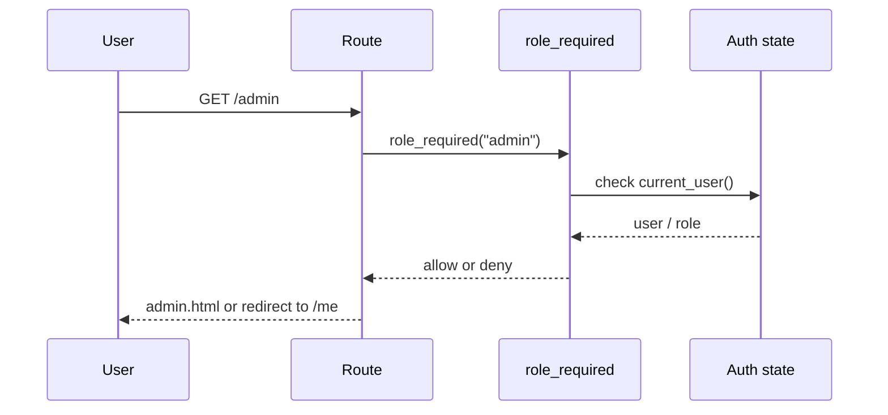
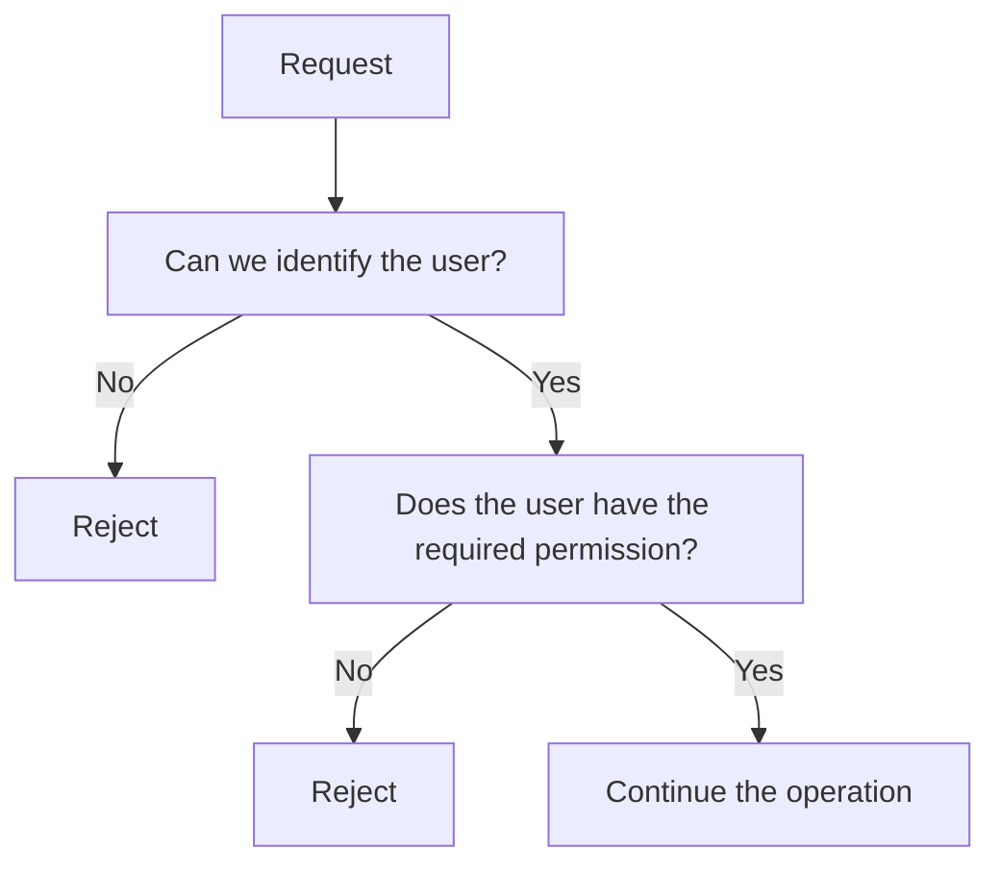
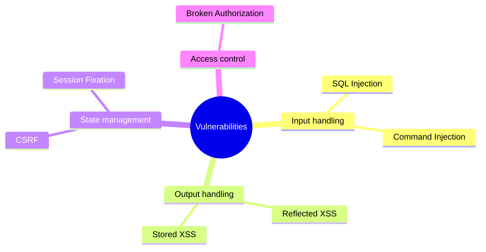
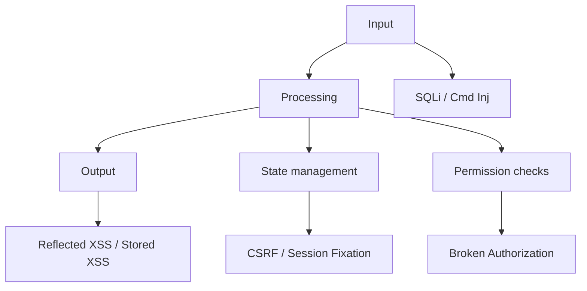

# Lecture 7
## Broken Authorization, Integrated Exercises, and Wrap-Up

- Course: Web Application Vulnerability Lab
- Theme: Understand broken authorization and review all vulnerabilities covered so far
- Goal: Explain authorization failures, access control, and the relationship between major vulnerabilities

---

# Learning Goals

- Explain the difference between authentication and authorization
- Explain why broken authorization is dangerous
- Explain the role of `/admin` and `role_required`
- Classify the vulnerabilities covered in this course
- Match common defenses to the problems they mitigate

---

# Agenda

1. Review
2. Basics of broken authorization
3. The `/admin` page in our teaching app
4. Code walkthrough of `role_required`
5. Integrated exercises
6. Wrap-up

---

# Review of the Previous Lecture

- Session fixation is dangerous because the same identifier is reused after login
- Command injection happens when user input affects an OS command
- State management and safe API usage matter

Today's focus:

- Who is allowed to access a resource
- Where permission checks should happen

---

# Authentication vs Authorization

- Authentication
  - Who are you?
- Authorization
  - What are you allowed to do?

Example:

- Checking whether a user is an `admin` is authorization
- Checking whether a user is logged in is authentication

---

# Relationship Between Authentication and Authorization



---

# Authentication Alone Is Not Enough



---

# What Is Broken Authorization?

Broken authorization:

- A user can access data or functions that should not be available to them

Examples:

- A normal user opens an admin page
- A user edits another user's data
- A user gains extra privileges by changing a URL

---

# Why Is It Dangerous?

- Being logged in does not automatically make an action safe
- "Logged in" is not enough to protect admin features
- Sensitive data may leak
- Unauthorized updates or deletions may happen

Key idea:

- Authorization is required after authentication

---

# Target Pages in the Teaching App

- `/admin`
  - Intended for administrators only
- `/me`
  - Available to any logged-in user

Comparison:

- `/me` requires authentication
- `/admin` requires authentication and authorization

---

# Access Flow for `/admin`



---

# The `/admin` Route

```python
@main_bp.get("/admin")
@role_required("admin")
def admin():
    return render_template("admin.html")
```

Points:

- `@role_required("admin")` is the important protection
- The route body is simple, but the pre-check matters

---

# The `role_required` Implementation

```python
def role_required(required_role):
    def decorator(view):
        @wraps(view)
        def wrapped_view(*args, **kwargs):
            user = current_user()
            if user is None:
                return redirect(url_for("main.login"))
            if user.role != required_role:
                flash("You do not have permission to access that page.")
                return redirect(url_for("main.me"))
            return view(*args, **kwargs)
        return wrapped_view
    return decorator
```

---

# How to Read This Code

- `user is None`
  - Redirect unauthenticated users to the login page
- `user.role != required_role`
  - Reject users with the wrong role
- `return view(...)`
  - Execute the route only when the checks pass

So:

- "Logged in" alone is not enough

---

# Access Control Flow



---

# Common Examples of Broken Authorization

- No role check on an admin page
- Anyone can access a privileged URL if they know it
- The UI hides a button, but the server does not enforce the rule
- The server does not verify ownership of data

Important:

- Hiding a button is not a defense

---

# Organizing the Vulnerabilities We Studied

| Vulnerability | Main problem area |
|---|---|
| SQL Injection | Building SQL from user input |
| Reflected XSS | Output in the immediate response |
| Stored XSS | Displaying saved data |
| CSRF | Missing validation of state-changing requests |
| Session Fixation | State management before and after login |
| Command Injection | OS command execution |
| Broken Authorization | Permission checks |

---

# Four Perspectives



---

# Connecting the Whole Course



---

# We Can Organize Defenses Too

| Perspective | Basic defense |
|---|---|
| Input handling | Avoid string concatenation, use safe APIs |
| Output handling | Keep auto-escaping enabled |
| State management | CSRF tokens, session regeneration, proper cookie settings |
| Access control | Enforce permissions on the server |

---

# Mapping the Teaching App

| Page / feature | Main lesson |
|---|---|
| `/login`, `/logout`, `/me` | Authentication |
| `/lab-settings`, `/debug/session` | Auth modes and state observation |
| `/users` | SQL Injection |
| `/reflect` | Reflected XSS |
| `/board` | Stored XSS |
| `csrf_demo_server.py` | CSRF |
| `/ping` | Command Injection |
| `/admin` | Broken Authorization |

---

# Integrated Exercise 1
## Check Authorization

Steps:

1. Log in as `alice`
2. Access `/admin`
3. Observe what happens
4. Log in again as `admin`
5. Access `/admin` again

What to observe:

- Who is allowed
- Where the request is stopped

---

# Integrated Exercise 2
## Classify the Vulnerabilities

For each feature, decide which category fits best.

- Input handling
- Output handling
- State management
- Access control

Targets:

- `/users`
- `/reflect`
- `/board`
- `/logout`
- `/ping`
- `/admin`

---

# Integrated Exercise 3
## Match Defenses to Problems

Decide which defense is effective against which issue.

- Placeholders / parameterized queries
- Auto-escaping
- CSRF tokens
- Session ID regeneration
- `shell=False`
- `role_required`

---

# A Good Way to Read Code

When reading code, check these points.

1. Where does input come from?
2. Where is it transformed?
3. Where is it output or executed?
4. Where are login state and permissions checked?

---

# What We Learned in This Course

- A web app works through the combination of input, output, state management, and access control
- Vulnerabilities are not isolated tricks; they are design problems
- Defenses are usually basic engineering practices applied carefully

---

# Summary

- Broken authorization fails to protect features that should not be open to everyone
- Authorization is needed after authentication
- The vulnerabilities covered in this course become easier to understand when grouped by perspective
- Secure implementation starts with careful handling of input, output, state, and permissions

---

# Suggestions for Further Study

- Rebuild the same features in another framework and compare them
- Observe HTTP using browser developer tools or Burp Suite
- Read secure and insecure implementations side by side
- Add a small feature yourself and think about where risk appears

---

# Example Final Assignment

- Add one protected page like `/admin`
- Design which role is required
- Protect it on the server side
- Briefly explain the expected vulnerability and the defense

---

# Thank You

- You have now covered the foundations of common web application vulnerabilities
- The key is to connect "why it is dangerous" with "what needs to be fixed"
